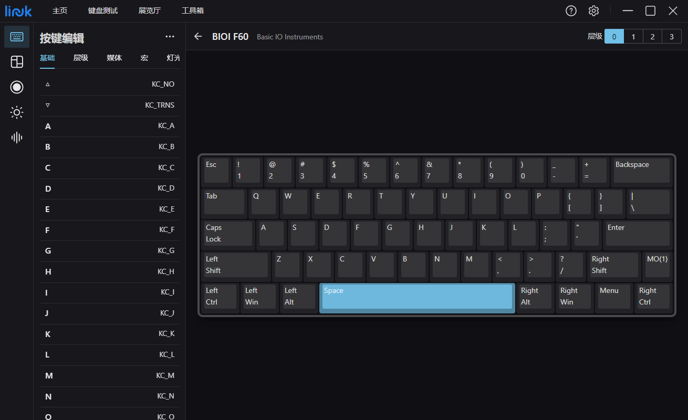

  

<h1 align="center">LINK+</h1>

<b>一款多功能集成、跨平台、高兼容性的键盘助手</b>

中文 | <a href="README.md">English</a> 

## 文档

[www.lnelab.com](www.lnelab.com)

## LINK 和 LINK+

LINK 起始于 2020 年 7 月，经过了两年多的迭代，其各方面表现已经趋于稳定，我们按照前期规划逐步完成了 LINK 各项功能的开发，同时我们也与多个制造商或团体进行了合作，推动更多的用户了解和使用 LINK 。

俗话说，天下没有不散的筵席，随着需求的不断膨胀，现有的框架已经不足以支持我们继续开发，再加上 QMK Firmware 社区对固件核心代码的调整，LINK 失去了兼容新版 QMK Firmware 的能力，不知不觉发展到了生命周期的尽头。

LINK+ 是 LINK 的后继者，是由我们在 LINK 的基础上进行全面重构的全新作品。

### 开始上手

请下载支持 Windows 和 macOS 操作系统的 [LINK+](https://github.com/lnelab/link-plus/releases)。 LINK+ 将定期更新，提供新功能和错误修复。如果你对这个项目感兴趣，请联系我们！

### 发行版
* [Releases on GitHub](https://github.com/lnelab/link-plus/releases)
* [Releases on Gitee](https://gitee.com/lne-lab/link-plus/releases)

### 反馈
* [Github](https://github.com/lnelab/link-plus/issues)
* 官方 QQ 群 1107582873

## 许可证
Copyright (c) LNE Lab. All rights reserved.